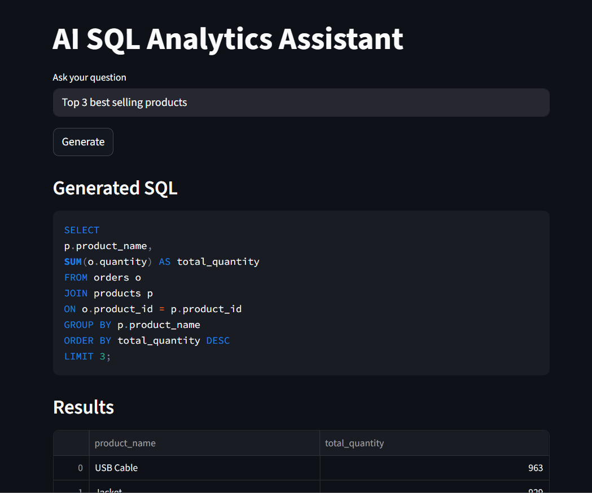
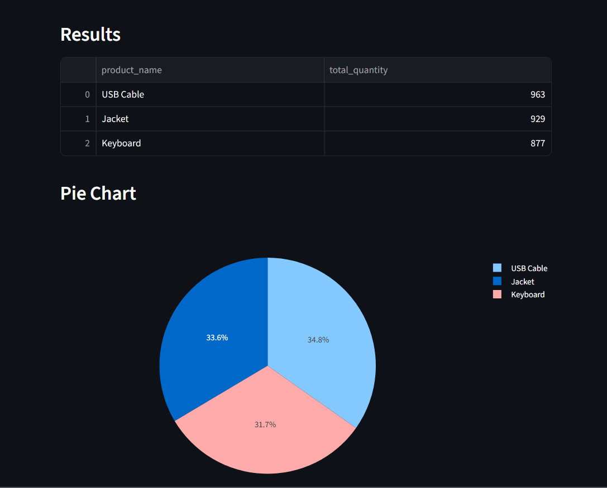
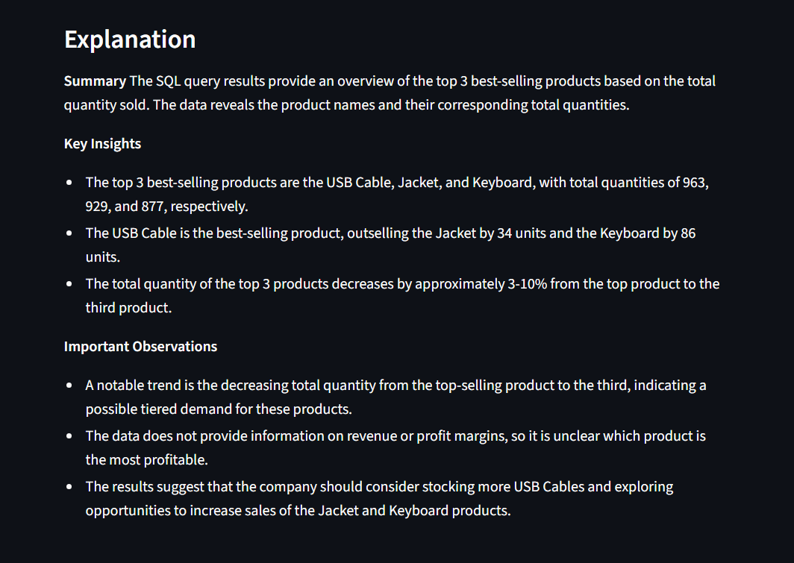

# Data Query AI Assistant

Built an AI-powered SQL Analytics Assistant using LangChain, PostgreSQL, and Streamlit that converts natural language into SQL queries, executes them on structured databases, generates dynamic visualizations, and produces automated business insights using LLMs.

---

## Screenshots

### Natural Language to SQL
Users can ask business questions in natural language, and the system generates SQL automatically.



### Result & Visualization
Automatic chart generation from SQL results.



### AI-Powered Business Insights
LLM-generated explanation of query results.



---

## Problem Statement

Traditional database querying requires SQL knowledge, making data exploration difficult for non-technical users. This project bridges the gap by allowing users to query databases using plain English.

---

## Features

- Natural Language → SQL conversion
- PostgreSQL database integration
- Dynamic schema loading
- SQL execution pipeline
- Interactive data tables
- Automatic chart generation
- Key insights & observations generation for business purpose.

---

## Tech Stack

### Languages
- Python

### Libraries & Frameworks
- LangChain
- Streamlit
- SQLAlchemy
- Pandas
- Plotly

### Database
- PostgreSQL

### LLM
- Groq API

---

## Project Architecture

```text
User Query
     ↓
Streamlit UI
     ↓
LangChain + LLM
(Schema Context + SQL Generation)
     ↓
PostgreSQL
(Query Execution)
     ↓
Pandas DataFrame
     ├── Visualization
     └── LLM-based Insights
     ↓
Interactive Results Dashboard
```
---

## Workflow

**Step 1: User Query**

User asks a question in plain English.

```text
Example:

Show top 5 regions with maximum profit 
```

**Step 2: Schema Injection**

Database schema is dynamically loaded and sent to the LLM.

**Step 3: SQL Generation**

The LLM converts the query into PostgreSQL SQL.

**Step 4: Query Execution**

Generated SQL is executed safely on PostgreSQL.

**Step 5: Visualization**

Results are displayed as:

- Tables
- Bar Charts
- Line Charts
- Pie Charts

**Step 6: Insights**

LLM uses the data to generate explanation for business needs in the form of summary, key insights and important observations.

---

## Folder Structure

```text
Data Query AI Assistant/
│   .env
│   .gitignore
│   main.py
│   README.md
│   requirements.txt
│
├───app
│   ├───database
│   │   │   db_connection.py
│   │   │   schema_loader.py
│   │
│   │
│   ├───llm
│   │   │   output_generator.py
│   │   │   prompt_template.py
│   │
│   ├───utils
│   │   │   query_executor.py
│   │   │   visualization.py
│
└───images
        Explanation.png
        Result.png
        sql_generation.png

```

---

## Installation

```bash
# Clone Repository
git clone https://github.com/Vaishnavi-020/Data-Query-AI-Assistant.git

cd Data-Query-AI-Assistant

# Create Virtual Environment
python -m venv venv

# Activate virtual environment
# Windows
venv\Scripts\activate

# Mac/Linux
source venv/bin/activate

# Install Dependencies
pip install -r requirements.txt

# Setup Environment Variables
# Create .env

DATABASE_URL=
API_KEY=

# Load dataset
python db_connection.py

# Run Application
streamlit run main.py

```

---

## Example Queries

### Try asking:
- How many products were sold over time?
- Show the top 10 products with the highest total sales revenue along with their category and brand.
- Which product categories generated the most revenue, and how many unique customers purchased from each category?

---

## Challenges Faced

### Automatic chart detection

Since the generated SQL queries could return different column combinations every time, creating reliable charts was difficult. In several cases, visualizations were not getting generated correctly because columns were being interpreted with incorrect data types (for example, dates being treated as objects or numeric values not being detected properly).

To solve this, I repeatedly debugged and improved the datatype detection logic by dynamically converting columns into appropriate formats such as numeric and datetime whenever possible. I also refined the visualization conditions to handle different query outputs instead of assuming a fixed structure. This process involved multiple iterations of testing and debugging to make the dashboard more reliable for real-world, unpredictable SQL results.

---

## Future Improvements
- Authentication System
- Deployment

---

## Author

Vaishnavi Sinha

- **LinkedIn**: [https://www.linkedin.com/in/vaishnavi-sinha-v2005/]
- **GitHub**: [https://github.com/Vaishnavi-020]
